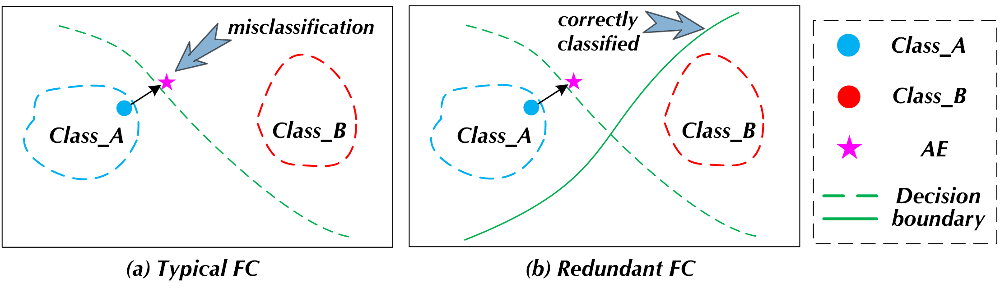

### ⚔️ WWW_RFC

## Introduction

Redundant fully connected (FC) layer is a novel technology to improve the model’s robustness. The so-called redundant FC layer refers to a dense layer mapped to $n \times class_{num}$ dimensions that will replace the typical FC layer. Therefore, there are $n$ positions corresponding to the ground-truth (GT) label. As long as either one of the 𝑛 positions presents the largest predicted probability, the model will perform the correct prediction. 
